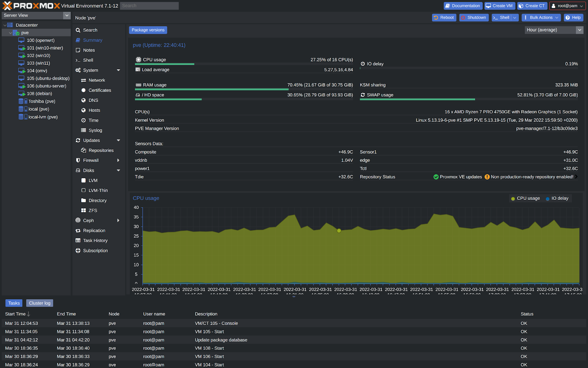
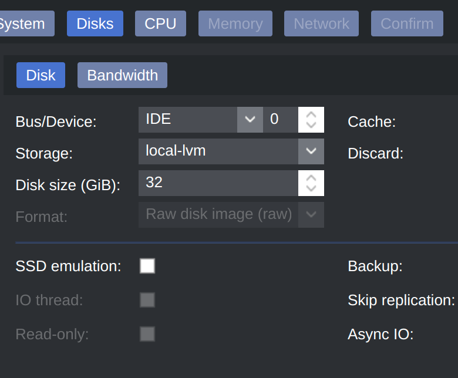

家用AIO考虑24*7运行的电费成本需要低功耗cpu，找了半天选择amd4700ge，这u没有零售只有OEM直接淘宝。

配置清单：
CPU：AMD 4700ge 8核16线程 TDP 35瓦
风扇：玄冰风6铜管
主板: 微星MAG B550M MORTAR WIFI
内存：2 * 16G
固态：英睿达P5 1T
供电：850瓦全模组
UPS：SVC BX1450L
硬盘：4 * 西数紫盘8T(WD80PURX)

硬盘裸装win10，8核16线程，适合跑多任务:


内存：


amd vega radeon集成显卡：


cpuz:


cpuz集成显卡:


cpu跑分：单线程533，多线程5300


待机功耗：


英睿达P5健康度：


英睿达P5读写测速：


内存8g，频率3000，鲁大师跑分：

</br>
</br>

---

</br>

接下来进入bios开启amd虚拟化，安装pve，开启硬件直通，在虚拟机里测性能



</br>

## 安装大礼包：
apt update
apt upgrade -y
apt install curl ufw lm-sensors apt-transport-https ca-certificates htop net-tools ethtool iperf3 vim git fail2ban -y

vim /etc/fail2ban/jail.conf, 把bantime改成60m
fail2ban-client status sshd

## 查看cpu当前工作频率：
watch -n 2 "cat /proc/cpuinfo | grep MHz"

## 查看cpu工作模式：
apt install cpufrequtils
cpufreq-info

### 设为节能模式：
bash -c 'for ((i=0;i<$(nproc);i++)); do cpufreq-set -c $i -g powersave; done'

### 设为按需模式：
bash -c 'for ((i=0;i<$(nproc);i++)); do cpufreq-set -c $i -g ondemand; done'

### 设为性能模式：
bash -c 'for ((i=0;i<$(nproc);i++)); do cpufreq-set -c $i -g performance; done'

## 查看温度：
apt install lm-sensors
sensors


## 安装深色主题：
bash <(curl -s https://raw.githubusercontent.com/Weilbyte/PVEDiscordDark/master/PVEDiscordDark.sh ) install

## 安装pvetools扩展功能：
https://github.com/ivanhao/pvetools


## 安装ufw防火墙
apt install ufw
ufw status
ufw allow 22/tcp
ufw enable
ufw allow 8006/tcp
ufw allow 4000/tcp
iptables -L

## iperf3测速
pve宿主机作为server: iperf3 -s -p 4000
pve虚拟ubuntu作为client: iperf3 -p 4000 -c 192.168.2.150


pve待机功耗：


跟裸装win10待机功耗相同，都是20瓦。

pve虚拟一台win10待机功耗：


多了3瓦。


pve虚拟win10，cpu类型选host，分配所有线程跑分：


分数很接近裸装win10，性能损失3%左右。

pve虚拟win10，磁盘为IDE测速：



pve虚拟win10，磁盘为SCSI测速：


显而易见，应该选择SCSI作为虚拟机磁盘格式。

但选择SCSI安装win10不能识别磁盘，需要加载驱动：


解决直通分组问题：
[https://pve.proxmox.com/wiki/Pci_passthrough#AMD_CPU](https://pve.proxmox.com/wiki/Pci_passthrough#AMD_CPU)

[https://mechanical-consciousness.com/2020/03/20/kvm-gpu-passthrough.html](https://mechanical-consciousness.com/2020/03/20/kvm-gpu-passthrough.html)

[https://post.smzdm.com/p/alpwlzvp/
](https://post.smzdm.com/p/alpwlzvp/
)

分组前：


由上图可见，安装2张显卡后3070显卡跟主板2.5G网卡的分组都是9，把3070直通给win10后整个pve宿主机都断网失控，这时就要对PCI设备进行分组

分组后3070变成17，2.5G网卡变成20：


甚至板载AX200无线网卡也分了新的组19，之后就可以进行正常直通。

测试显卡挖矿，直通后性能没有损失，跟裸装一样：


pve虚拟openwrt，cpu类型选host，分配所有线程跑分：


pve虚拟debian作为server: iperf3 -s -p 4000
pve虚拟ubuntu作为client: iperf3 -p 4000 -c 192.168.2.103


pve虚拟2台win10，互拷文件：


## 意外断电
把ups的usb直通给win10-miner，停电后立马关机


\
\
bash脚本自动关机，pve会先关掉所有vm再关宿主机，前提是每个vm都安装了qemu-guest-agent：
mkdir -p /root/shutdown
vim shutdown.sh
```
#!/bin/sh

# apt install curl -y

ip="192.168.2.x"  # ip which will detecting
time=30             # interval time of detecting (seconds)
triedCount=12        # try count
failCount=0         # failed count

chat_id=""
telegramToken=""

path="/root/shutdown/"

while true
do
    date=`date +%Y-%m-%d`
    logfile=$path$date'.log'

    hostname=hostname
    echo "Detected hostname: `${hostname}`" >> $logfile

    notification="curl -X POST --header 'Content-Type: application/json' --data-raw '{\"chat_id\":\"$chat_id\",\"text\":\"`$hostname` is shutting down.\"}' -m 10 https://api.telegram.org/bot$telegramToken/sendMessage"
    # eval $notification

    now=`date +%Y-%m-%d\ %H:%M:%S`
    # if ping $ip -4 -c 2 | grep 'time=' > $path'temp.log'
    if ping $ip -4 -c 2 | grep 'time=' >> $logfile
    then
        echo $now 'ping success' $failCount >> $logfile
        failCount=0
    else
        failCount=`expr $failCount + 1`
        echo $now 'ping failed' $failCount >> $logfile
        if test $failCount -ge $triedCount
        then
            echo $now 'execute shutdown' >> $logfile
            eval $notification
            shutdown -h now
        fi
    fi
    sleep $time
done
```

vim /etc/rc.loacl
```
#!/bin/bash

cd /root/shutdown/ && nohup ./shutdown.sh > /dev/null 2>&1 &

#exit 0
```

chmod +x /etc/rc.loacl
reboot


