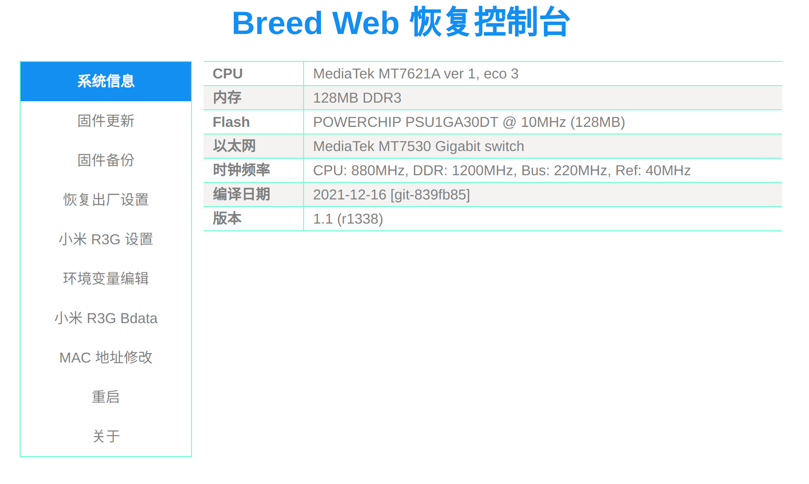
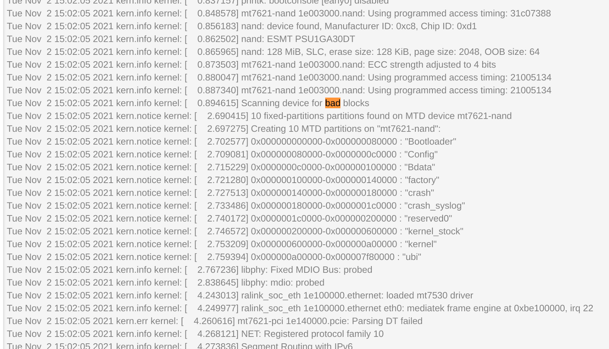

来自小黄鱼￥119

\
\

红米原系统：

\
\
检查是否坏块：http://i.lckiss.com/?p=6761

中奖，没有坏块！
\
\
刷写breed：https://www.lotlab.org/2021/06/13/install-openwrt-on-redmi-ac2100/

\
\
刷入openwrt，固件来源：https://www.right.com.cn/forum/thread-6529167-1-1.html

\
\
检查是否有坏块：

\
\
\
如果wifi无法开机自启，在启动项中添加命令：

ifconfig ra0 up  
ifconfig rai0 up

\
\
\
意外的是，ac2100的cpu跟k2p相同，但跑分高不少，k2p只有4500：
  

