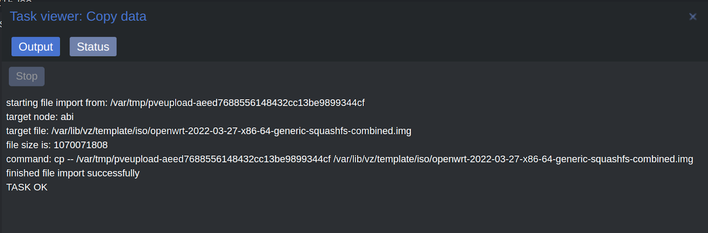
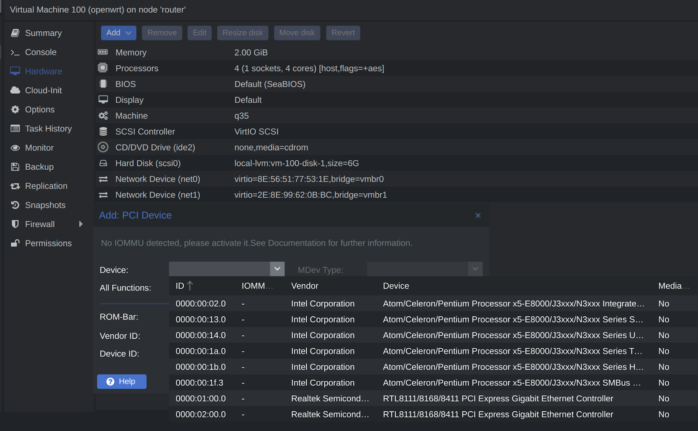
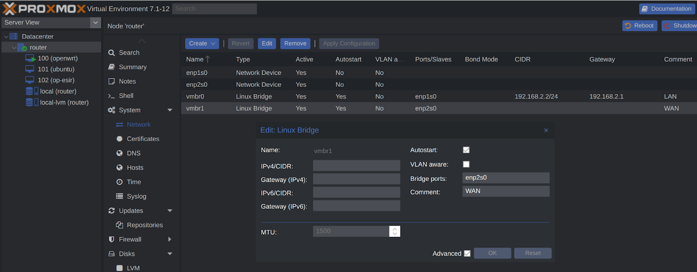
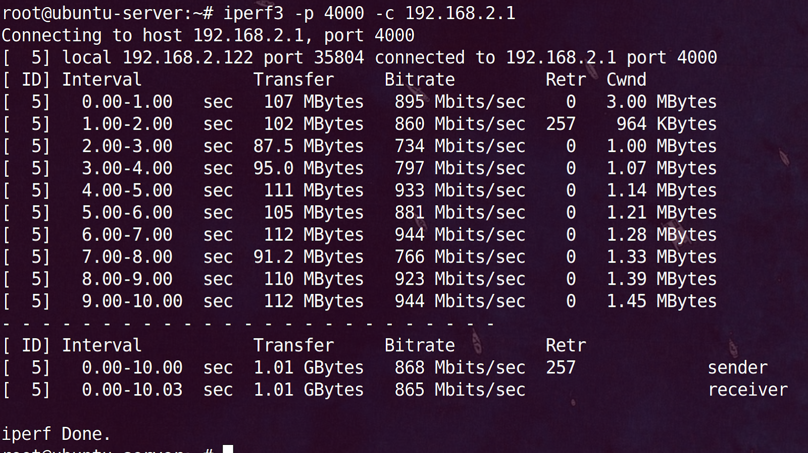

# 一、上传镜像

如果是压缩包img.gz格式要先解压成img上传

pve版本7上传完成会显示文件存放路径: /var/lib/vz/template/iso

pve版本6双击下方操作日志也会显示。

# 二、创建vm

一路下一步，过程省略。

可以选择不使用ios镜像。

完成后把默认磁盘删了。

# 三、生成磁盘

ssh登录pve宿主机
进入镜像存放目录: cd /var/lib/vz/template/iso
创建磁盘: qm importdisk 100 /var/lib/vz/template/iso/openwrt-2022-03-27-x86-64-generic-squashfs-combined.img local-lvm

# 四、加载磁盘

双击未使用磁盘，添加：

扩容5G：

# 五、添加网卡

如果cpu支持vt-d硬件直通，则在“硬件添加pci”设备

如果cpu不支持vt-d硬件直通，则只能使用桥接网卡，先到pve节点网络下创建桥接网卡，备注为WAN口：

回到openwrt硬件，添加网络设备，选择WAN：

# 六、修改配置

开机自启（start at boot）改为Yes

启动顺序（boot order）改成附加的磁盘：

启用qemu guest agent，让pve宿主机能够与vm通讯：

# 七、启动openwrt

在pve web界面进入控制台ssh，按回车看到输入光标

vim /etc/config/network
把lan口静态ip改成192.168.2.1

重启生效: /etc/init.d/network restart

浏览器登录openwrt

用磁盘管理（diskman）把扩容的5G分区格式化成ext4，挂载给/opt目录，docker会使用opt作为overlay空间，不会消耗根目录容量。

ssh登录查看磁盘用量，df -Th：

# 八、cpu跑分

ssh执行: cd /etc && ./coremark.sh

有的镜像是/sbin/cpumark，执行: cpumark

# 九、网卡测速

opkg install iperf3
server: iperf3 -s -p 4000
client: iperf3 -p 4000 -c 192.168.2.1

因为不是直通，n3160性能偏弱跑不满千兆，7、800也够用。

# 十、把ash改成bash
opkg update && opkg install bash
编辑 /etc/passwd 文件
修改第一行（第一行就是 root 用户）中的 /bin/ash，改成 /bin/bash
保存重启路由器生效

查看 /etc/shells 文件可以看到当前系统中有哪些可用的 shell 解释器
/bin/ash
/bin/bash
/bin/rbash

安装vim：opkg install vim

利用bash快速找到历史命令，创建文件：vim ~/.inputrc，粘贴：
"\e[A": history-search-backward
"\e[B": history-search-forward
set show-all-if-ambiguous on
set completion-ignore-case on

设置快捷键，创建文件：vim ~/.bashrc，粘贴内容：
HISTSIZE=-1
HISTFILESIZE=-1

alias ll='ls -alhFtr'
alias la='ls -A'
alias l='ls -CF'

执行命令生效：source ~/.bashrc

# 十一、远程记录日志
[https://www.betaflare.com/3730.html](https://www.betaflare.com/3730.html)

# 十二、增大session过期时间

vim /etc/config/luci

option sessiontime '36000'

# 十三、安装qemu guest agent

opkg install qemu-ga

pve显示openwrt ip：

# 十四、修改“半双工”

pve虚拟的openwrt网卡实际为全双工，显示为半双工且没有速度，可通过命令修改

临时生效: ethtool -s eth0 speed 1000 duplex full

永久生效: vim /etc/init.d/network

之后就是配置常用插件，自由发挥。

